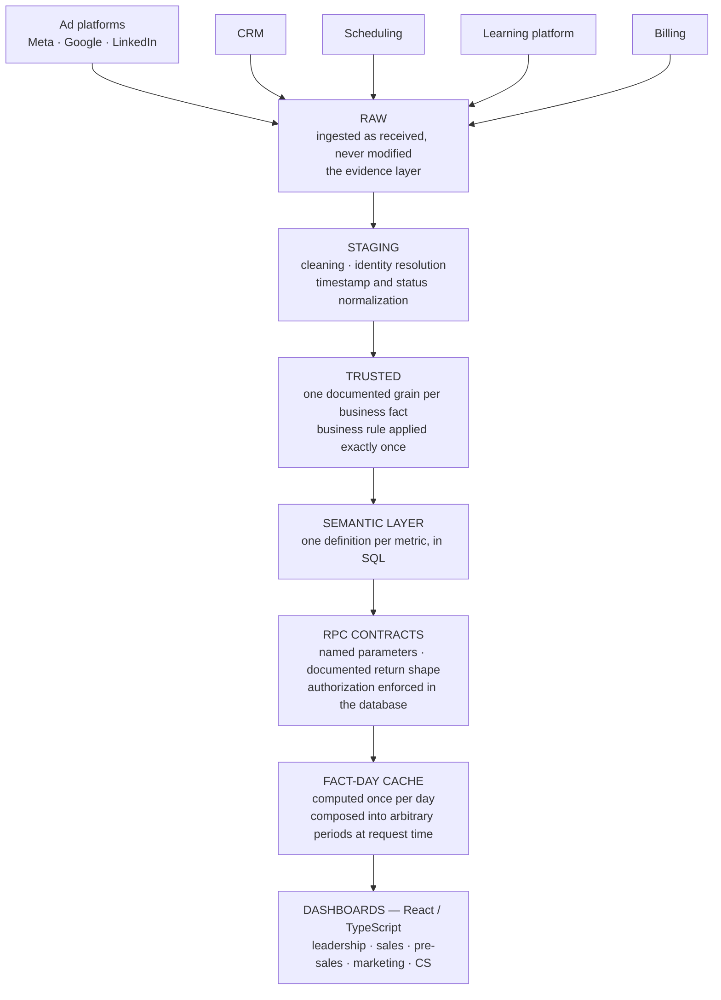

# Revenue data platform

**Company** Coders — tech education (Brazil, with an international placement program)
**Role** Revenue Operations, leading the data and technology squad
**Period** March 2026 – present
**Stack** PostgreSQL · Supabase · SQL · React · TypeScript · Node.js · Python

> This describes work done inside a company system. The source code is proprietary and is not published here. What follows is the architecture and my contribution to it.

---

## Context

A tech education company sells a program with a long, multi-touch funnel: a lead arrives through paid media, organic social or referral, gets qualified by an SDR, books a call, is closed by a Closer, and then becomes a student whose success journey runs for months. Revenue depends on all five stages, but each stage lived in a different system — ad platforms, CRM, scheduling, the learning platform, the billing system.

The consequence was not that numbers were missing. It was that there were several of each. Marketing, sales and the board each had a "conversion rate", computed from a different source, at a different grain, with different rules about what counts as a call. Decisions were being argued instead of made.

## The problem

Three problems stacked on top of each other:

1. **No single funnel.** Nobody could follow one lead from ad click to enrolled student to retained customer, because no table joined those worlds.
2. **No agreed definitions.** "Call realizada", "lead qualificado" and "venda" each had two or three live definitions across teams.
3. **No trustworthy grain.** Aggregations were computed ad hoc over raw operational tables, so the same question asked twice returned two answers depending on when the data was pulled and which filter someone remembered to apply.

## What I built

**A layered data architecture — raw → staging → trusted.**

- **Raw** keeps ingested data as it arrived from each source system, unmodified. When a number is questioned, this layer is the evidence.
- **Staging** does the cleaning and the hard part: identity resolution. The same person arrives as a Meta lead, a CRM contact, a calendar invitee and a platform student, with different keys in each. Staging reconciles them into one entity with a stable identity, and normalizes the timestamps and status vocabularies that each source spells differently.
- **Trusted** is the layer the business reads. One row grain per business fact, documented, with the business rule applied exactly once — inside the model, not inside a dashboard filter.

**A semantic layer in SQL.** Every commercial metric has one definition, in one place, expressed as a view or a function. "Call realizada" means one thing, and every team that asks for it gets that thing. Changing the rule means changing one object, not hunting through dashboards.

**Read-optimized access.** The consuming applications never issue arbitrary SQL. They call RPCs with an explicit contract — named parameters, a documented return shape, and the authorization rule applied by the database rather than by the client. That keeps query plans predictable, keeps row-level security enforceable, and means the frontend cannot accidentally invent a new metric definition.

**Caching by fact-day.** Commercial dashboards ask for the same aggregates repeatedly across overlapping periods. Facts are computed once per day and composed into arbitrary periods at request time, with freshness tracked per layer, so a director's dashboard does not re-scan history on every page load.

**Dashboards per team, in React and TypeScript**, reading those RPCs in real time: daily commercial indicators and funnels by channel, per-closer and per-SDR performance, pre-sales CRM and call distribution, marketing by channel down to creative level, customer success health and retention, and an executive view with targets, cash flow and forecast.

## Architecture

The direction of that arrow is the whole argument. A number shown to the board can be walked backwards through every layer to the row a source system emitted, and the business rule that produced it exists in exactly one place along the way.

## Decisions and trade-offs

**Identity resolution belongs in staging, not in the dashboard.** The same person arrives as a Meta lead, a CRM contact, a calendar invitee and a platform student, with a different key in each. The tempting fix is to join on email at query time, in each dashboard that needs it. That works until two dashboards disagree about what counts as the same person — and they will, because one of them will normalize casing and the other will not. Resolving identity once, in staging, costs more to build and removes an entire class of "why do these two screens disagree" from the company's life.

**The application may not write SQL.** Every read goes through an RPC with an explicit contract. This is more work than exposing tables and letting the frontend query them. It buys three things: query plans stay predictable because the shapes are fixed, row-level security stays enforceable because the rule lives in the database rather than in a client that can be bypassed, and — most importantly — the frontend is structurally incapable of inventing a new definition of a metric. Metric drift in a company does not happen by decision. It happens because someone added a filter to a dashboard.

**Facts are computed per day and composed in the application.** Commercial dashboards ask for overlapping periods constantly: today, this week, month to date, the same month last year. Computing each period from scratch re-scans history on every page load. Computing immutable facts once per day and summing them for any requested window trades a cache invalidation problem for a scan problem, and the cache invalidation problem is the one you can reason about — a closed day does not change.

**The analytical layer is read-only by default, and that is enforced, not requested.** No writes, no DDL, no indexes, no materialized views added to fix a performance problem that can be fixed in the application. The few components that genuinely need to write go through a separate, explicitly listed path with an automated guardrail. The reason is not caution for its own sake: an analytical workload that can write to a production database will eventually write to it during an incident, at the worst possible moment, by someone reasonable who is in a hurry.

**Commission logic is where modeling mistakes get discovered immediately.** Most data modeling errors surface slowly — a metric is subtly wrong for a quarter before anyone notices. Commission is different: it turns closed deals into what a person is paid, and it is audited by the most motivated reviewers in the company. Building it forced a level of rigor about grain and edge cases that the rest of the model benefited from.

## The operating side

The platform is only half the work. I also own the process it measures:

- **Commercial KPI definition** — deciding what the company actually manages by, then making the model reflect it.
- **Commission logic** — the rules that turn closed deals into what each seller is paid, which is the part of the data platform where a modeling mistake costs real money and gets noticed immediately.
- **Squad management** — two commercial squads (SDRs and Closers): targets, individual performance tracking and hiring.
- **Reengagement flows** — WhatsApp cadences segmented by funnel behavior (referrals, no-shows, calls held without conversion), which turn a dormant funnel stage back into pipeline.

Managing the squads is what makes the data work different. I am not building a dashboard for a persona in a document — I sit in the meeting where the number is used, and I know which ones get ignored.

## Why the engineering discipline mattered

This platform reads a production database that a live business depends on. The rule I work by is that the analytical layer is **read-only by default**: no writes, no DDL, no indexes, no materialized views added to solve a performance problem that can be solved in the application. The few components that genuinely need to write do so through a separate, explicitly listed path, enforced by an automated guardrail rather than by discipline alone.

The same principle applies to change: nothing structural is applied to production without impact analysis, dependency mapping, a migration, a rollback and a validation plan. The full method is in [Database engineering practice](database-engineering-practice.md).

## Outcome

- A single funnel view from first lead contact through the student success journey, used daily by leadership, sales, pre-sales, marketing and customer success.
- One definition per metric, replacing the parallel spreadsheets each team maintained.
- Commercial decisions — channel budget, squad allocation, forecast — made from a shared model rather than from competing exports.

## Related

- [Multi-channel marketing attribution](marketing-attribution.md) — the acquisition end of this same funnel
- [Customer health & churn prevention](customer-health-and-churn.md) — the retention end
- [Database engineering practice](database-engineering-practice.md) — how changes reach production safely
